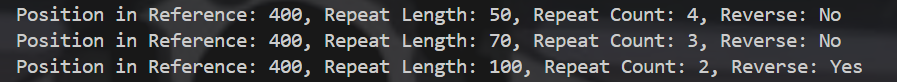

# 寻找样本 DNA 序列中的重复片段

[TOC]

## 1. 算法伪代码

### 1.1 哈希表存储

用哈希表存储reference及其逆转序列的所有子串。

```c
Function create_hash_table(ref_seq):
    substring_map ← MAP  // 用于存储子串的起始位置和是否为互补反向标志
    ref_len ← LENGTH(ref_seq)

    // 正向子串处理
    FOR i ← 0 TO ref_len - 1 DO:
        substring ← ""  // 当前子串
        FOR j ← i TO ref_len - 1 DO:
            substring ← substring + ref_seq[j]
            substring_map[substring] ← (i, FALSE)  // 存储正向子串的起始位置

    rev_comp_seq ← generate_reverse_complement(ref_seq)  // 生成逆转互补序列

    // 反向互补子串处理
    FOR i ← 0 TO ref_len - 1 DO:
        substring ← ""  // 当前子串
        FOR j ← i TO ref_len - 1 DO:
            substring ← substring + rev_comp_seq[j]
            sub_len ← j - i + 1
            start_pos ← ref_len - 1 - j
            IF substring NOT IN substring_map THEN:
                substring_map[substring] ← (start_pos, TRUE)  // 存储反向互补子串的起始位置

    RETURN substring_map
```

### 1.2 动态规划进行片段划分

用动态规划计算从`query`开头到末尾的最小划分段数。

```c
Function get_optimal_segments(query, substring_map):
    n ← LENGTH(query)
    dp ← ARRAY[n + 1] INITIALIZED TO n + 1  // dp[i] 表示从 i 到末尾的最小段数
    dp[n] ← 0  // 空串划分段数为 0
    trace ← ARRAY[n]  // 记录转移信息
    interval_count ← MAP  // 统计区间出现次数

    FOR i ← n - 1 DOWNTO 0 DO:
        min_segments ← n + 1
        best_trace ← NULL
        FOR j ← i TO n - 1 DO:
            sub ← query[i..j]  // 提取子串
            IF sub IN substring_map THEN:
                next_pos ← j + 1
                segments ← 1 + dp[next_pos]  // 当前段数
                start, is_rc ← substring_map[sub]  // 获取子串起始位置和是否为互补翻转
                len ← next_pos - i
                interval_key ← (start, start + len - 1)  // 当前区间

                IF segments < min_segments THEN:
                    min_segments ← segments
                    best_trace ← (next_pos, start, is_rc)
                ELSE IF segments = min_segments THEN:
                    current_count ← interval_count[interval_key]
                    best_interval ← (best_trace[1], best_trace[1] + len - 1)
                    best_count ← interval_count[best_interval]
                    IF current_count > best_count THEN:
                        best_trace ← (next_pos, start, is_rc)  // 优先选择重复次数多的区间

        IF min_segments ≤ n THEN:
            dp[i] ← min_segments
            trace[i] ← best_trace
            interval_key ← (best_trace[1], best_trace[1] + (best_trace[0] - i) - 1)
            interval_count[interval_key] ← interval_count[interval_key] + 1

    RETURN trace
```

### 1.3 挑选合法的序列

```c
Function create_hash_table(ref_seq):
    substring_map ← MAP  // 用于存储子串的起始位置和是否为互补反向标志
    ref_len ← LENGTH(ref_seq)

    // 正向子串处理
    FOR i ← 0 TO ref_len - 1 DO:
        substring ← ""  // 当前子串
        FOR j ← i TO ref_len - 1 DO:
            substring ← substring + ref_seq[j]
            substring_map[substring] ← (i, FALSE)  // 存储正向子串的起始位置

    rev_comp_seq ← generate_reverse_complement(ref_seq)  // 生成逆转互补序列

    // 反向互补子串处理
    FOR i ← 0 TO ref_len - 1 DO:
        substring ← ""  // 当前子串
        FOR j ← i TO ref_len - 1 DO:
            substring ← substring + rev_comp_seq[j]
            sub_len ← j - i + 1
            start_pos ← ref_len - 1 - j
            IF substring NOT IN substring_map THEN:
                substring_map[substring] ← (start_pos, TRUE)  // 存储反向互补子串的起始位置

    RETURN substring_map
```

## 2. 时空复杂度

| 函数 | 时间复杂度 | 空间复杂度 |
|------|----------|----------|
| `get_complement` | \( O(1) \) | \( O(1) \) |
| `generate_reverse_complement` | \( O(N) \) | \( O(N) \) |
| `create_hash_table` | \( O(N^2) \) | \( O(N^2) \) |
| `get_optimal_segments` | \( O(M^2) \) | \( O(M) \) |
| `find_repeated_segments` | \( O(K^2) \) | \( O(K) \) |
| `output_results` | \( O(K) \) | \( O(1) \) |
| **总复杂度** | \( O(N^2 + M^2 + K^2) \) | \( O(N^2 + M + K) \) |

## 3. 运行结果截图



## 4. github仓库地址

`https://github.com/pretne/repetitive-segments-in-a-sample-DNA-sequence.git`